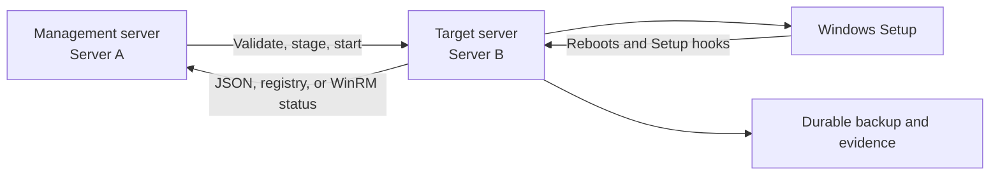

# Windows Server OS Upgrade Automation

PowerShell automation for running a controlled, observable, and recoverable
in-place Windows Server upgrade from a separate management server.

> **Primary use case:** upgrade one eligible Windows Server at a time with
> repeatable prechecks, mandatory recovery evidence, reboot-resilient progress
> tracking, and independent final-build verification.

## What this project solves

A manual in-place upgrade can fail before Setup starts, disconnect the remote
session during reboot, leave an operator unsure whether the target is still
running, or appear successful without proving that the expected build is live.
This project turns that workflow into a defined operational process:

| Operational need | How this project addresses it |
| --- | --- |
| Decide whether a target is safe to upgrade | Runs a complete assessment before backup or Setup. |
| Preserve recovery and audit evidence | Captures host state, policy, services, diagnostics, and a required system-state backup. |
| Continue through multiple reboots | Runs target-side tracking locally through scheduled tasks and Windows Setup hooks. |
| Monitor without owning the upgrade process | The management server reads state; closing it does not stop target-side execution. |
| Avoid false success | Requires terminal target state and an independent live build-number match. |
| Recover monitoring after interruption | `-MonitorOnly` reconnects to an existing run without launching Setup again. |
| Prevent overlapping operations | Global mutexes serialize target startup and cleanup. |

## Where it fits

Use this project for a Microsoft-supported in-place upgrade of a standalone or
member Windows Server when all of the following are true:

- The server is not a Domain Controller or failover-cluster node.
- The installation media is newer than the current build and matches the
  installed edition and installation type.
- A maintenance window, rollback plan, and recoverable backup are approved.
- WinRM and local administrative access are available from a management host.
- The complete workflow has already been proven on a representative disposable
  clone or lab server.

Do not use it to make an unsupported upgrade path valid, perform a clean
installation, upgrade a Domain Controller, perform a cluster rolling upgrade,
or replace an enterprise backup and disaster-recovery process.

## Architecture



| Component | Responsibility |
| --- | --- |
| Management server | Runs the orchestrator, stages files, displays progress, records orchestration logs, and independently verifies the final live build. |
| Target server | Runs assessment, backup, Setup launch, phase tracking, rollback detection, and post-upgrade validation. It remains authoritative across reboots. |
| Windows Setup hooks | Publish OOBE completion or rollback immediately using the required `setupcomplete.cmd` and `setuprollback.cmd` filenames. |
| Status channels | Expose target state through a JSON file, registry over CIM/DCOM, and authenticated WinRM. |

The orchestrator is intentionally not the upgrade engine. After kickoff, the
target continues independently even if the management console closes or the
management server restarts.

## Package layout

```text
WindowsServerOSUpgradeAutomation/
|-- LGPO.zip
|-- ServerA-Orchestrator/
|   `-- Start-RemoteUpgradeOrchestrator.ps1
|-- ServerB-Target/
|   |-- OSUpgradeShared.ps1
|   |-- Remove-OrphanedProfiles.ps1
|   |-- Remove-UpgradeArtifacts.ps1
|   |-- Start-TargetUpgrade.ps1
|   |-- Update-UpgradeStatus.ps1
|   |-- setupcomplete.cmd
|   `-- setuprollback.cmd
|-- Tests/
|   |-- Orchestrator.Tests.ps1
|   |-- Run-SafeTests.ps1
|   `-- UpgradeStatus.Tests.ps1
`-- README.md
```

Keep `ServerA-Orchestrator` and `ServerB-Target` as sibling directories. The
setup hook filenames are required by Windows Setup and must not be changed.

The normal entry point is
`ServerA-Orchestrator\Start-RemoteUpgradeOrchestrator.ps1`. Target-side scripts
are staged automatically; do not pre-copy or launch them manually during a
normal run.

## Production safety model

- **Fail closed:** unknown startup state, failed required backup, unconfirmed
  Setup launch, or unverified completion cannot be reported as success.
- **Serialized execution:** a second target run or conflicting cleanup is
  rejected while an operation owns the global mutex.
- **Independent completion proof:** success requires both target-recorded
  completion and a separately queried live build that matches the target media.
- **Honest uncertainty:** loss of all status channels is shown as unknown or
  offline. It is not converted into a fabricated phase or failure.
- **Bounded monitoring:** a timeout exits with code `2`; it does not terminate
  the target-side upgrade or imply that Setup failed.
- **Protected cleanup:** cleanup rejects active or unreadable state, unsafe
  paths, and reparse points. `-Force` does not bypass path validation.
- **Durable evidence:** content under `D:\UpgradeBackup` is never removed by
  automated cleanup.

Passing the local test suite verifies script parsing and isolated behavior. It
does not certify installation media, drivers, applications, firmware,
networking, recovery procedures, or a specific server for production.

## Production prerequisites

### Management server

- Windows PowerShell 5.1 and permission to run local scripts.
- Name resolution and network access to the target.
- WinRM over HTTP 5985 or HTTPS 5986.
- A local Administrator account on the target. Use `-Credential` when the
  current identity is not sufficient.
- SMB access to the target administrative share is recommended for the JSON
  status channel. CIM/DCOM and WinRM provide alternate reads.

### Target server

- A Microsoft-supported Windows Server source and target upgrade path.
- Compatible installation media with the same edition and installation type,
  and a build newer than the installed build.
- Exactly one `.iso` file in `D:\ISO` by default.
- At least 32 GB free on the system drive by default.
- A writable backup location on a non-system volume,
  `D:\UpgradeBackup` by default.
- Local Administrator or SYSTEM execution context.
- No pending reboot, Domain Controller role, or failover-cluster role.
- Healthy component store and protected system files.

### Network paths

| Traffic | Purpose | Requirement |
| --- | --- | --- |
| WinRM HTTP 5985 or HTTPS 5986 | Preflight, staging, kickoff, status fallback, and final verification | Required. Use HTTPS where environment policy requires it. |
| SMB 445 / administrative share | Preferred direct read of the status JSON | Recommended; monitoring can fall back to other channels. |
| CIM/DCOM RPC | Registry-based status fallback | Optional but improves visibility while WinRM is unavailable. |
| ICMP | Reachability hint only | Optional; blocked ping does not prevent richer probes. |

### Production approval checklist

- [ ] The source-to-target upgrade path is supported by Microsoft.
- [ ] The ISO source and integrity have been verified.
- [ ] Application, driver, firmware, security-tool, and monitoring-agent
      compatibility has been approved.
- [ ] A representative clone has completed the same full upgrade workflow.
- [ ] A restorable backup or snapshot exists and its recovery procedure has
      been tested.
- [ ] The backup volume has sufficient capacity for system state and evidence.
- [ ] The maintenance window allows for assessment, backup, Setup, reboots,
      validation, and contingency time.
- [ ] Console access or another out-of-band recovery path is available.
- [ ] The local regression suite and target `-PrecheckOnly` run both pass.
- [ ] No lab-only skip switch is present in the approved production command.

## Validate the package

Run the local, non-operational regression suite from the package root:

```powershell
& powershell.exe -NoProfile -NonInteractive -ExecutionPolicy Bypass `
    -File '.\Tests\Run-SafeTests.ps1'
```

Expected result:

```text
All safe tests passed. No operational entry point was executed.
```

The suite parses every PowerShell file and runs isolated orchestrator, status,
and cleanup assertions. It does not contact a target or start an upgrade.

For an additional static-analysis gate, install PSScriptAnalyzer and run:

```powershell
& '.\Tests\Run-SafeTests.ps1' -Analyze
```

## Production runbook

Run all commands from the package root in an elevated Windows PowerShell 5.1
session on the management server.

### 1. Prepare optional LGPO support

The normal backup captures Local Group Policy without LGPO. To add a portable
LGPO backup, follow [Optional LGPO integration](#optional-lgpo-integration)
before assessment so `LGPO.exe` is staged with the target-side package.

### 2. Run assessment only

```powershell
& powershell.exe -NoProfile -NonInteractive -ExecutionPolicy Bypass `
    -File '.\ServerA-Orchestrator\Start-RemoteUpgradeOrchestrator.ps1' `
    -TargetComputer 'SERVER01' `
    -IsoFolder 'D:\ISO' `
    -BackupRoot 'D:\UpgradeBackup' `
    -PrecheckOnly
```

Assessment mode runs all prechecks, writes reports, and may temporarily mount
the ISO. It does not perform the backup stage or launch Windows Setup.

Do not approve the full run until the command exits `0` and target state is
`AssessmentPassed`. Resolve every blocking finding and rerun assessment; do not
use a lab override to convert a production blocker into a warning.

### 3. Run the upgrade

```powershell
& powershell.exe -NoProfile -NonInteractive -ExecutionPolicy Bypass `
    -File '.\ServerA-Orchestrator\Start-RemoteUpgradeOrchestrator.ps1' `
    -TargetComputer 'SERVER01' `
    -IsoFolder 'D:\ISO' `
    -BackupRoot 'D:\UpgradeBackup' `
    -StatusJsonPath 'D:\upgrade_status.json' `
    -TimeoutMinutes 240
```

This production example intentionally contains no skip switches. Adjust the
timeout to the approved window; the default is 180 minutes.

For alternate credentials:

```powershell
$credential = Get-Credential
& '.\ServerA-Orchestrator\Start-RemoteUpgradeOrchestrator.ps1' `
    -TargetComputer 'SERVER01' `
    -Credential $credential
```

Use `-UseSSL` to require WinRM HTTPS. Certificate validation remains enabled
unless `-SkipCertificateCheck` is passed explicitly. Prefer a trusted
certificate whose subject matches `-TargetComputer`.

### 4. Resume monitoring after interruption

If the management console closes or its timeout expires, the target-side
upgrade continues. Resume without staging files or launching Setup again:

```powershell
& '.\ServerA-Orchestrator\Start-RemoteUpgradeOrchestrator.ps1' `
    -TargetComputer 'SERVER01' `
    -MonitorOnly `
    -TimeoutMinutes 240
```

Do not rerun the normal kickoff command merely because the target is rebooting
or the orchestrator returned exit code `2`. Use `-MonitorOnly` first and inspect
the existing state.

### 5. Accept the result

Before closing the change, verify all of the following:

- The orchestrator returned exit code `0`.
- Status is `Completed` or `CompletedWithWarnings`.
- The independently queried live build equals the target build.
- Any `CompletedWithWarnings` findings have an owner and disposition.
- The pre-upgrade and post-upgrade service comparison has been reviewed.
- The system-state backup and its `wbadmin` log exist.
- Target and orchestrator logs have been retained with the change evidence.
- Required applications, agents, network paths, and business services pass
  their post-upgrade checks.

### 6. Clean up tracking artifacts

Clean up only after evidence has been reviewed and the result accepted. See
[Cleanup](#cleanup). The durable backup folder is intentionally preserved.

## Upgrade stages

| Stage | What happens | Failure behavior |
| --- | --- | --- |
| 1. Pre-upgrade assessment | Evaluates server role, cluster state, disk space, pending reboot, DISM, SFC, media compatibility, newer target build, activation, patch age, VMware Tools, RDS licensing compatibility, and orphaned profiles. | All checks are recorded. A blocking result stops before backup or Setup. |
| 2. Backup | Captures registry hives, Local Group Policy, security policy, Resultant Set of Policy, RDS licensing data when present, service baseline, host diagnostics, and `wbadmin` system state. | A required backup failure stops before Setup. |
| 3. Windows Setup kickoff | Registers monitoring, reboot, setup-launch, and cleanup tasks; launches Setup from a local SYSTEM scheduled task. | Kickoff fails if the Setup process cannot be confirmed. |
| 4. Reboot-resilient tracking | Tracks Downlevel, Safe OS, First Boot, and OOBE using local state, scheduled tasks, and Setup hooks. | Connectivity gaps are reported as unconfirmed, not guessed. |
| 5. Post-upgrade validation | Verifies the target build, activation recommendation, and services against the baseline. | Critical validation failure records `Failed`; noncritical findings produce `CompletedWithWarnings`. |

The target publishes measured task completion for assessment and backup, then
uses Windows Setup telemetry where available. During WinPE no live telemetry
exists, so the last confirmed value is retained rather than inventing progress.

## Precheck decision summary

Typical blocking findings include Domain Controller or cluster membership,
insufficient space, pending reboot, confirmed DISM/SFC corruption, incompatible
or non-newer media, outdated or unhealthy VMware Tools on VMware, stale patch
state under the normal production policy, and confirmed orphaned profiles.

Activation and RDS licensing compatibility findings are reported for review
without automatically asserting that Setup cannot run. The detailed report and
console output remain authoritative for the specific run.

## Status and logs

Default target artifacts:

| Artifact | Default location |
| --- | --- |
| Status JSON | `D:\upgrade_status.json` |
| Registry status | `HKLM:\SOFTWARE\OSUpgradeAutomation` |
| Runtime logs | `C:\ProgramData\OSUpgradeAutomation\Logs` |
| Durable backup and evidence | `D:\UpgradeBackup\<run timestamp>` |

Management-server logs are written to
`C:\ProgramData\OSUpgradeAutomation\OrchestratorLogs`.

The durable run folder can include registry hives, policy exports, host
diagnostics, service baselines/comparisons, Windows Server Backup output,
progress history, and cleanup history. Contents vary when a role or optional
tool is not applicable.

### Status values

| Status | Meaning |
| --- | --- |
| `InProgress` | A target-side operation is active or awaiting the next phase. |
| `AssessmentPassed` | `-PrecheckOnly` completed successfully; backup and Setup were not run. |
| `Completed` | Target-side validation passed. The orchestrator reports success only after separately confirming the live build. |
| `CompletedWithWarnings` | Target-side build validation passed, but findings require review. The orchestrator still confirms the live build independently. |
| `Failed` / `RolledBack` | The target recorded a terminal failure or Windows Setup rollback. Preserve evidence before retrying. |
| `Unknown` | No authoritative state could be read. This is not success or failure. |

### Monitoring channels

The orchestrator attempts the status JSON over the administrative share,
registry state over CIM/DCOM, and authenticated WinRM. Temporary connectivity
loss during Safe OS is expected. Ping is informational only and never proves
upgrade state.

## Common parameters

| Parameter | Default | Purpose |
| --- | --- | --- |
| `-TargetComputer` | Required | Target hostname or IPv4 address. |
| `-Credential` | Current identity | Alternate target administrative credential. |
| `-UseSSL` | Off | Require WinRM HTTPS 5986 instead of probing HTTP first. |
| `-IsoFolder` | `D:\ISO` | Target folder containing exactly one upgrade ISO. |
| `-MinFreeSpaceGB` | `32` | Required free space on the system drive. |
| `-BackupRoot` | `D:\UpgradeBackup` | Non-system volume for durable backup and evidence. |
| `-StatusJsonPath` | `D:\upgrade_status.json` | Target status file used by monitoring. |
| `-RetentionDays` | `14` | Delay before terminal tracking artifacts are eligible for automatic cleanup. |
| `-DisableAutoCleanup` | Off | Keep tracking artifacts until manual cleanup. |
| `-PrecheckOnly` | Off | Assess only; do not back up or launch Setup. |
| `-MonitorOnly` | Off | Observe an existing run without staging or kickoff. |
| `-TimeoutMinutes` | `180` | Overall monitoring budget after kickoff. |
| `-PhaseStallWarningMinutes` | `45` | Informational warning interval for an unchanged phase. |
| `-UseControlledReboot` | Off | Launch Setup with `/NoReboot` and initiate the first restart under script control. |
| `-MaxPatchAgeDays` | `60` | Maximum acceptable age for patch-currency evaluation. |
| `-MinVMwareToolsVersion` | `12.0.0` | Minimum VMware Tools version when VMware is detected. |

## Exit codes

| Code | Meaning |
| ---: | --- |
| `0` | Assessment passed or upgrade completed and was independently verified. |
| `1` | Assessment, kickoff, rollback, or target-reported failure. |
| `2` | Monitoring ended without independently confirmed completion. The target may still be running. |

Treat exit code `2` as unresolved, not failed. Start `-MonitorOnly`, inspect the
target status and logs, and use console access if all remote channels remain
unavailable.

## Failure and recovery actions

| Situation | Action |
| --- | --- |
| Assessment fails | Fix every blocking finding and rerun `-PrecheckOnly`. Setup has not started. |
| Windows Server Backup is newly installed and requests a reboot | Reboot the target, rerun `-PrecheckOnly`, then start a new full run. |
| Backup or Setup kickoff fails | Preserve the logs, correct the cause, and rerun only after confirming no target-side operation is active. |
| Management console closes | Leave the target alone and reconnect with `-MonitorOnly`. |
| Orchestrator exits `2` | Treat the outcome as unknown. Use `-MonitorOnly`; do not assume failure or start a duplicate upgrade. |
| Target is unreachable during Safe OS | Wait within the approved timeout. Loss of WinRM and SMB during WinPE can be normal. |
| Status is `CompletedWithWarnings` | Review every warning and complete application/service acceptance before closure. |
| Status is `Failed` or `RolledBack` | Preserve status, Panther/Setup logs, orchestrator logs, and backup evidence before cleanup or retry. |
| Orphaned profiles block assessment | Review the reported SIDs and use `Remove-OrphanedProfiles.ps1` only after confirming the profiles are no longer required. |

The automation records Windows Setup rollback but does not restore the server
from backup. Disaster recovery remains an operator-controlled procedure.

## Lab-only switches

The following switches reduce validation or recovery coverage and must not be
used for production acceptance:

- `-SkipPatchCheckLab`
- `-SkipDismScanHealthLab`
- `-SkipSfcScanNowLab`
- `-SkipSystemStateBackup`

Each skipped check is recorded explicitly in the run evidence.

`-SkipCertificateCheck` is separate from the lab switches but weakens HTTPS
identity verification. Use a trusted certificate in production instead of
making bypass the normal connection method.

## Optional LGPO integration

The Microsoft LGPO package is included as `LGPO.zip`. To enable portable Local
Group Policy backup, extract `LGPO_30\LGPO.exe` and place the executable
directly in `ServerB-Target` before starting the orchestrator:

```powershell
Expand-Archive -LiteralPath '.\LGPO.zip' -DestinationPath '.\LGPO' -Force
Copy-Item -LiteralPath '.\LGPO\LGPO_30\LGPO.exe' `
  -Destination '.\ServerB-Target\LGPO.exe'
```

The archive also contains its documentation and standalone use terms. The
automation works without the executable and still captures policy through its
built-in methods.

## Cleanup

Automatic cleanup runs after `-RetentionDays` when terminal state is confirmed,
unless `-DisableAutoCleanup` is used. To clean tracking artifacts manually
after reviewing the result:

```powershell
& powershell.exe -NoProfile -NonInteractive -ExecutionPolicy Bypass `
    -File '.\ServerB-Target\Remove-UpgradeArtifacts.ps1'
```

Use `-Force` only after independently confirming that no upgrade is active.
Cleanup removes scheduled tasks, runtime metadata, the status JSON, and the
runtime folder. It intentionally preserves `D:\UpgradeBackup`.

## Operational limitations

- One orchestrator invocation manages one target. Fleet scheduling,
  maintenance-wave control, and centralized credential management are outside
  this project.
- The scripts do not download installation media or decide whether an upgrade
  path is supported.
- Application-specific validation is not automatic beyond the generic service
  comparison and host checks.
- A local regression pass is not a substitute for a full upgrade rehearsal on
  representative hardware or a representative virtual machine.
- Monitoring depends on at least one remote status channel becoming available;
  out-of-band console access is required for a target that never returns.
- Backups are evidence and recovery inputs. Their existence does not prove that
  the organization's recovery procedure will succeed.

## Evidence to retain

For troubleshooting, audit, or handoff, retain:

- The management-server orchestrator log.
- The target status JSON and relevant registry snapshot before cleanup.
- Target runtime and progress logs.
- The full `D:\UpgradeBackup\<run timestamp>` folder.
- Windows Setup Panther and rollback logs when Setup fails or rolls back.
- The final live OS caption/build result and application acceptance evidence.
